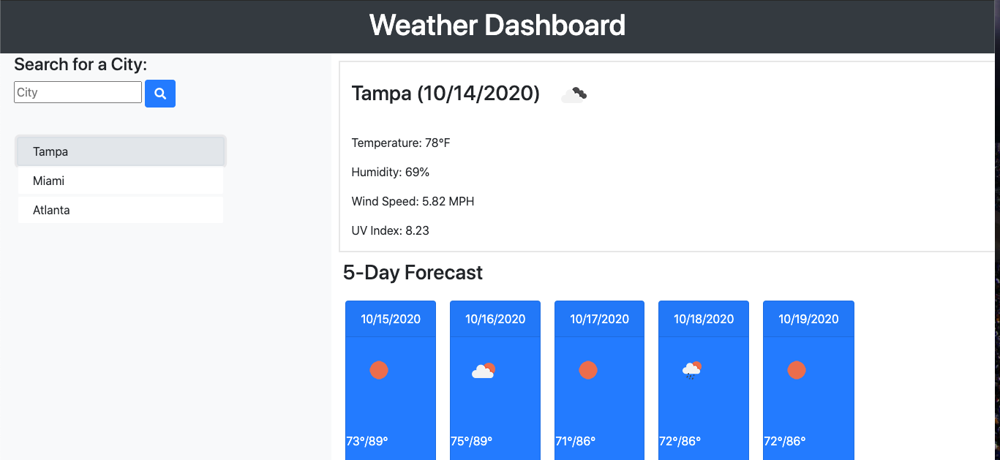
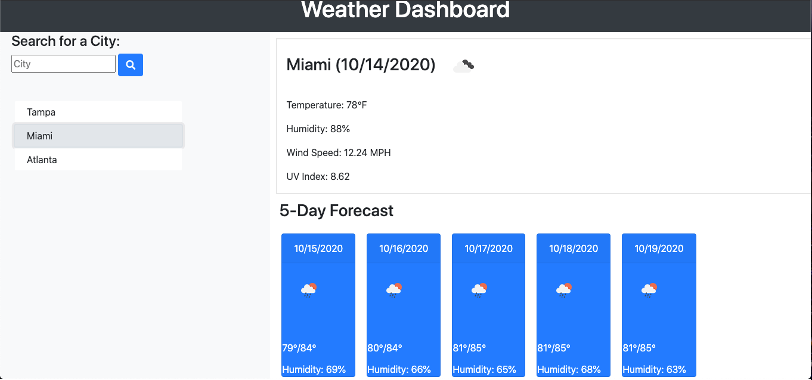

# multicity-weather-dashboard

## Summary
In this assignment, we were given the task of creating a multi-city dashbard. When a user searches for a city,
the page is supposed to load current weather data and a 5 day forecast. In order to achieve this goal, we had to utilize our existing knowledge of HTML, CSS, Javascript, JQuery, and Bootstraps. The added layer to this assignment was to be able to access server side api's to return the information needed. This was done by using the Open Weather API in conjuntion with AJAX calls. 

## Instruction

Navigate to the following Github repository:
    https://github.com/hsaddanathan/multicity-weather-dashboard.git

Across the top of the page, click on the Fork button on the right.

Once you have done this, you will see the repo copied within your Github account

Click the Green "Code" Button, and copy repo link. 

Open Terminal and run "git clone (Paste Link Here)"

Once repo has been cloned, you can run " code ." to open in Visual Studio Code. 

From there, right click and select "Open in Default Browser" to preview the page, or you can inspect the code from Visual Studio Code.

Alternatively, if you would like to only view the page please reference:
    https://hsaddanathan.github.io/multicity-weather-dashboard/

## Deployed Site Images

Image shows forecast for Tampa

Image shows forecast for Miami

## Links

work-day-scheduler repository link:
    https://github.com/hsaddanathan/multicity-weather-dashboard.git

Github Deployed Site URL:
    https://hsaddanathan.github.io/multicity-weather-dashboard/

## Contributors 
[@hsaddanathan](https://github.com/hsaddanathan)

## License
MIT
